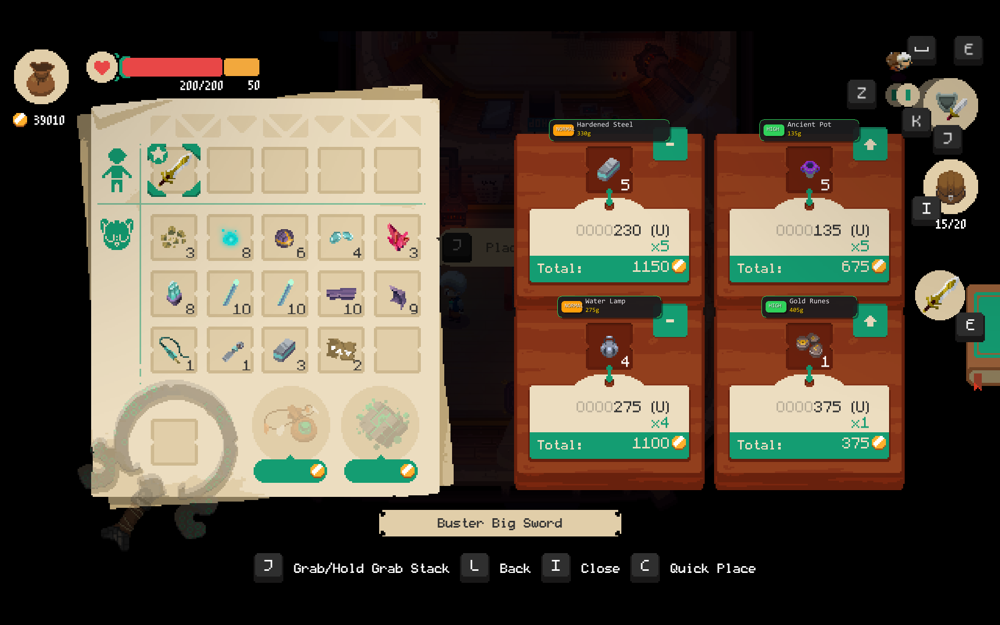
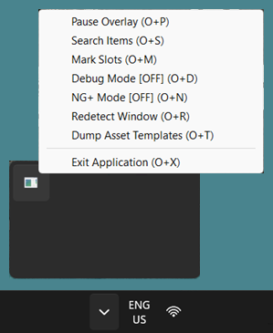

# moonlighter-overlay

Real-time overlay for *Moonlighter* that automatically detects shop items and displays optimal selling prices. Pre-built executable can be downloaded from [Releases](../../releases).

> **Note**: This project was vibe coded. Expect potential quirks or bugs.

## Features

- **Item Recognition**: Detects items placed in shop slots when the shop interface is open.
- **Price Displays**: Shows optimal price overlaid on the game window.
- **Hotkeys**: Configurable hotkeys to pause the overlay, toggle NG+ mode, or adjust settings.
- **System Tray Menu**: Background operation with access controls from the system tray.

## Usage

1. Launch *Moonlighter* and open the shop interface (table slots visible).
2. Launch `moonlighter_overlay.exe`.
3. Press `detect_window_hotkey` (default `O` + `R`) to detect the game window.
4. If item is not detected/incorrectly identified, press `manual_search_hotkey` (default `O` + `S`) to manually search for the item.

## Screenshots





## Configuration

Settings are saved in `moonlighter_overlay_config.toml` on launch.

| Key                     | Default           | Description                                                                                             |
|-------------------------|-------------------|---------------------------------------------------------------------------------------------------------|
| `target_window_title`   | `"^Moonlighter$"` | Regex pattern to match game window title                                                                |
| `debug_mode`            | `false`           | Toggle visual overlays and debug logs                                                                   |
| `ng_plus_mode`          | `false`           | Enable New Game+ item pricing                                                                           |
| `match_algorithm`       | `"ZNCC"`          | Image matching algorithm (`ZNCC`, `SAD`, `Chamfer`)                                                     |
| `use_simd`              | `true`            | Enable SIMD vector instructions                                                                         |
| `sample_step`           | `1`               | Subsampling step size for image matching                                                                |
| `detection_delay_ms`    | `500`             | Scan interval in milliseconds                                                                           |
| `render_delay_ms`       | `33`              | Render loop interval in milliseconds                                                                    |
| `debounce_ms`           | `100`             | Hotkey debounce interval in milliseconds                                                                |
| `leader_key`            | `"O"`             | Optional modifier key; if set (not `""`), hotkeys require pressing `leader_key` + hotkey simultaneously |
| `detect_window_hotkey`  | `"R"`             | Hotkey to re-detect game window                                                                         |
| `pause_overlay_hotkey`  | `"P"`             | Hotkey to pause overlay updates                                                                         |
| `manual_search_hotkey`  | `"S"`             | Hotkey to trigger manual item search                                                                    |
| `toggle_ng_plus_hotkey` | `"N"`             | Hotkey to toggle NG+ mode                                                                               |
| `exit_app_hotkey`       | `"X"`             | Hotkey to exit application                                                                              |
| `toggle_debug_hotkey`   | `"D"`             | Hotkey to toggle debug visualization                                                                    |
| `mark_region_hotkey`    | `"M"`             | Hotkey to define slot region                                                                            |
| `dump_templates_hotkey` | `"T"`             | Hotkey to dump template images for debugging                                                            |

## Development

### Asset Fetching

Fetch and update item templates and price tables from the Moonlighter Fandom wiki:

```sh
node assets/moonlighter.js
```

### Logging

Application output and diagnostics are automatically logged to `moonlighter_overlay.log` in the working directory if debug mode is enabled.
